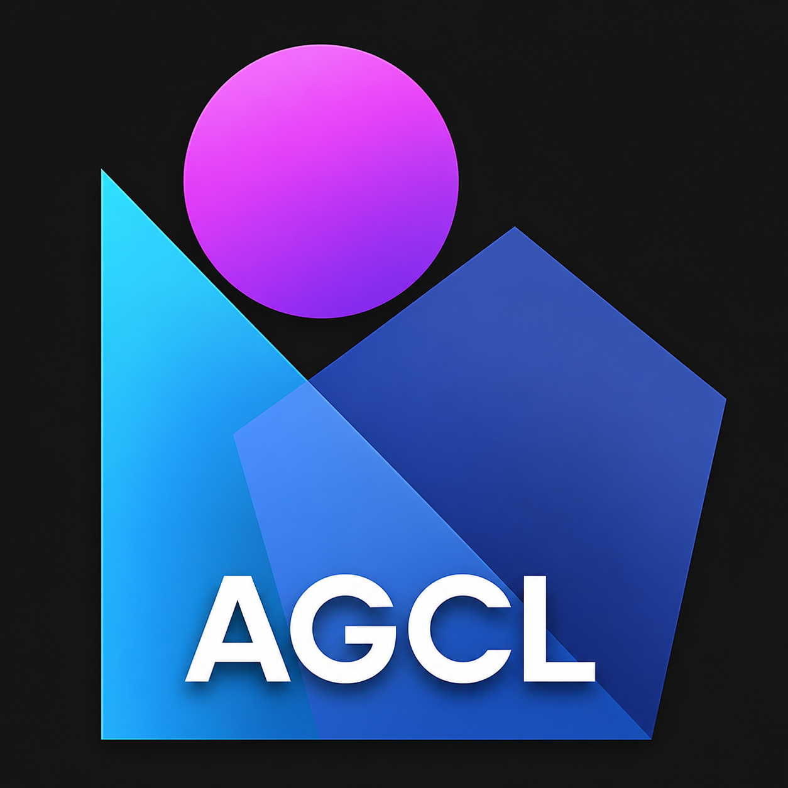

<p align="center">
  
</p>

<h1 align="center">AGCL — Agentic CLI</h1>

<p align="center">
  <em>Local-first agent runtime + recursive cognition layer + orchestrator for self-hosted endpoints.</em>
</p>

<p align="center">
  <a href="https://github.com/Agentra-Labs/AGCL"></a>
  <a href="https://www.python.org/downloads/"></a>
  <a href="https://pytorch.org/"></a>
  <a href="https://fastapi.tiangolo.com/"></a>
  <a href="https://huggingface.co/"></a>
  <a href="https://github.com/ggerganov/llama.cpp"></a>
  <a href="https://www.docker.com/"></a>
  <a href="https://kubernetes.io/"></a>
  <a href="https://cloud.google.com/run"></a>
  <a href="https://www.npmjs.com/package/@agcl/client"></a>
  <a href="https://vuejs.org/"></a>
  <a href="https://github.com/astral-sh/uv"></a>
  <a href="docs/dashboard.md"></a>
  <a href="https://modelcontextprotocol.io/"></a>
  <a href="https://docs.litellm.ai/"></a>
  <a href="https://ollama.com/"></a>
  <a href="https://docs.vllm.ai/"></a>
  <a href="https://redis.io/"></a>
  <a href="https://aws.amazon.com/s3/"></a>
  <a href="https://github.com/Agentra-Labs/AGCL/stargazers"></a>
  <a href="https://github.com/Agentra-Labs/AGCL/issues"></a>
  <a href="https://github.com/Agentra-Labs/AGCL/blob/main/LICENSE"></a>
  
  
</p>

---

AGCL does three things:

1. **Local-first chat agent.** A small llama.cpp model starts the response in
   ~50–300 ms; the cloud model (Claude / OpenAI / any LiteLLM-routed provider)
   continues from the same open assistant turn instead of restarting it.
2. **Recursive multi-agent runtime.** Two small projection MLPs sit between
   HuggingFace agents; the loop unrolls *n* rounds and only the final agent
   decodes text. Trains itself online from a one-shot cloud teacher answer
   and persists the trained links per topic.
3. **Local orchestrator.** `agcl run --output jsonl` plus
   `agcl orchestrate <playbook>` lets external tools (Multica, Cloud Run jobs,
   GitHub Actions, plain bash) drive AGCL or fan tasks across multiple
   self-hosted AGCL nodes — same wire format everywhere.

Idle behavior: sessions flush to disk, the local model unloads, everything
reloads on the next message. Over time AGCL learns which hours you use it and
can pre-warm before you open the terminal.

---

## What's in the box

| Component | What it does | Where it lives |
|---|---|---|
| **TUI shell** (default `python main.py`) | Long-running terminal app, arrow-key menus, slash commands | [agcl/tui.py](agcl/tui.py) |
| **Node server** (`python main.py node`) | HTTP + SSE API with bearer auth, full `/node/*` surface | [agcl/node.py](agcl/node.py) |
| **Recursive MAS** (`recursive run`) | InnerLink/OuterLink projections, online cloud-teacher training | [agcl/recursive/](agcl/recursive/) |
| **Mini-trainer** (`mini ...`) | Optional pluggable transformer/MLP that trains from captured latents | [agcl/mini/](agcl/mini/) |
| **Toolkit** (`toolkit ...`) | LiteLLM / Ollama / vLLM / TGI / Redis / S3 / Cloudflare / WebRTC / Docker / K8s / GCP adapters | [agcl/toolkit/](agcl/toolkit/) |
| **Headless runner** (`run --output jsonl`) | Multica / Cloud Run / Actions contract — emits the unified event taxonomy | [agcl/runner.py](agcl/runner.py) |
| **Orchestrator** (`orchestrate`) | Drive remote AGCL nodes via playbook or one-shot `--target` | [agcl/orchestrator.py](agcl/orchestrator.py) |
| **Config bundle** (`config export/import`) | Share whole AGCL setups; import-time hints instead of crashes | [agcl/config_bundle.py](agcl/config_bundle.py) |
| **Plugin system** | Drop a `.py` in `plugins/`, get HTTP routes + CLI commands + tools | [agcl/plugins.py](agcl/plugins.py) |
| **Usage tracker + quotas** | Per-provider token + cost recording (chat vs knowledge-formation), hard caps, custom OpenAI-compatible providers | [agcl/usage.py](agcl/usage.py) |
| **Dashboard** (`/node/dashboard`) | Single-file SPA: provider cards, session table, token graphs, quota editor, custom-provider menu | [agcl/dashboard.py](agcl/dashboard.py) |
| **MCP server** (`mcp` / `mcp --fast`) | stdio + SSE; FastMCP supported when installed | [agcl/integrations/](agcl/integrations/) |
| **Slack / Discord / OpenAgents / OpenAPI / Multica** | Adapters around the same tool registry | [agcl/integrations/](agcl/integrations/), [plugins/multica.py](plugins/multica.py) |
| **npm client** (`@agcl/client`) | TypeScript bindings for every node + toolkit route | [clients/npm/](clients/npm/) |

> **Documentation map**
>
> | If you want to... | Read this |
> |---|---|
> | Set up the project for the first time (no Python experience needed) | **[docs/guide.md](docs/guide.md)** — 15-min beginner walkthrough |
> | Understand every config knob in plain English | **[docs/configuration.md](docs/configuration.md)** — friendly reference |
> | Set up the recursive multi-agent feature with real models | **[docs/recursive/advanced.md](docs/recursive/advanced.md)** — picking models step by step |
> | Understand what auto-training is doing under the hood | **[docs/recursive/training.md](docs/recursive/training.md)** — the `[stage A]` / `[stage B]` lines explained |
> | **Integrate this PC into a GUI / web frontend** | **[docs/gui.md](docs/gui.md)** — landing page; node API, auth, SSE events, config map, TS client |
> | **Plug AGCL into MCP / Slack / Discord / OpenAgents / Zapier / Multica** | **[docs/integrations.md](docs/integrations.md)** — agent-platform adapters |
> | **Run AGCL in Docker, Kubernetes, GCP Cloud Run, or behind a LiteLLM gateway** | **[docs/integrations/cloud.md](docs/integrations/cloud.md)** — Docker, K8s, GCP, LiteLLM, Ollama, vLLM, Redis, S3, Cloudflare |
> | **Use AGCL from JavaScript / TypeScript** | **[docs/integrations/npm.md](docs/integrations/npm.md)** — `@agcl/client` package |
> | Pick the right depth for the recursive MAS feature (landing page) | **[docs/recursive.md](docs/recursive.md)** |
> | Get a terse technical reference for the multi-agent feature | **[docs/recursive/setup.md](docs/recursive/setup.md)** |
> | Add your own routes / commands / tools via plugins | **[docs/plugins.md](docs/plugins.md)** |
> | **Set per-provider quotas, register custom APIs, watch token usage** | **[docs/dashboard.md](docs/dashboard.md)** — `/node/dashboard` + `/node/usage/*` |
> | See what every code file does | **[docs/code-map.md](docs/code-map.md)** |
>
> The rest of this readme is a faster technical overview.

---

## Why

Cloud API latency is the main thing that makes AI assistants feel slow. The
first token from Claude or GPT-4 can take 1-3 seconds. A tiny local model
can produce the first 6 words in under 300ms. This project uses that gap:
show something immediately, then stream the real answer behind it.

The tradeoff is that the local model's opener is sometimes wrong. The cloud
model handles this with a recovery mode — by default it pivots naturally
without drawing attention to the mismatch.

---

## Requirements

- Python 3.10+
- A `.gguf` model file (any small instruction-tuned model, 1B-3B works well)
- An Anthropic or OpenAI API key (or both)

---

## Install

Pick `pip` or [`uv`](https://github.com/astral-sh/uv) — `uv` resolves +
installs ~10× faster and gives you isolated venvs by default.

### Option A — pip

```bash
git clone https://github.com/Agentra-Labs/AGCL.git
cd AGCL
python -m venv .venv && source .venv/bin/activate
pip install -r requirements.txt
```

### Option B — uv (recommended)

```bash
curl -LsSf https://astral.sh/uv/install.sh | sh   # one-time uv install

git clone https://github.com/Agentra-Labs/AGCL.git
cd AGCL
uv venv                                            # creates .venv/
uv pip install -r requirements.txt
source .venv/bin/activate
```

`uv pip install` is a drop-in for `pip install`, so all the optional
extras work the same:

```bash
uv pip install 'redis[hiredis]' aioboto3 litellm fastmcp discord.py
```

### Verify the install

The repo also ships a `pyproject.toml` so it installs as a normal
Python package + console script:

```bash
uv sync --extra dev          # or:  pip install -e ".[dev]"
uv run agcl --version        # -> 0.1.0
uv run pytest                # tests/test_package.py + any tests you add
```

`uv run agcl …` and `python main.py …` are equivalent — both call the
same `main()` dispatcher; pick whichever feels more natural.

### Optional: RecursiveMAS one-shot setup

```bash
python main.py autoconfig                   # creates mas.json, .env, models/hf/
python main.py autoconfig --install-deps    # also installs transformers
python main.py autoconfig --download        # also pre-downloads the HF models
```

`autoconfig` is idempotent — safe to run multiple times. It won't
clobber an existing `mas.json` unless you pass `--force`, and it
preserves any keys already in your `.env`.

### Optional: GPU acceleration for the local model

```bash
CMAKE_ARGS="-DLLAMA_CUDA=on" pip install llama-cpp-python --force-reinstall
# or:
CMAKE_ARGS="-DLLAMA_CUDA=on" uv pip install llama-cpp-python --force-reinstall
```

---

## Setup

API keys live in a gitignored `.env` file at the project root, loaded by
`AGCL/secrets.py`. Copy the template and fill it in:

```bash
cp .env.example .env
# then edit .env and add your key(s)
```

Other settings are environment variables. Required: `LOCAL_MODEL_PATH` for
the local prefix model. Everything else has a working default.

```bash
export LOCAL_MODEL_PATH=models/your-model.gguf
export DEFAULT_CLOUD=claude                 # or openai
```

You can still pass keys via env vars (or any secret manager) — process env
vars override the `.env` file. Never commit `.env`.

If your model is not instruction-tuned (i.e. it's a base model, not a chat
model), also set:

```bash
export PROMPT_FORMAT=plain
```

The plain format uses `Q: ... A:` instead of ChatML tags. If you see garbled
repetitive output from the local model, this is the first thing to try.

---

## Run

Everything runs through `main.py`. The CLI auto-starts the server on first
use, so a single command is enough:

```bash
python main.py
python main.py --session work          # named session, persists across restarts
python main.py --provider openai       # force a specific cloud provider
python main.py --recovery humor        # recovery style when local prefix is off
```

To run the server in the foreground (e.g. on a separate host):

```bash
python main.py serve --port 8000
# or equivalently
uvicorn main:app --port 8000
```

---

## How a response works

1. Your message hits the server.
2. The local llama.cpp model generates the first 6 words in ~50-300ms and
   streams them to your terminal immediately with a grey latency tag.
3. The cloud model receives those 6 words as an already-open assistant turn
   and continues from there, streaming chunks as they arrive.
4. The full response (prefix + continuation) is saved to the session.

If the local prefix is off, the cloud model recovers based on the recovery mode:

- `natural` — pivots to the right answer without mentioning the mismatch (default)
- `humor` — briefly and warmly acknowledges the mismatch before correcting
- `explicit` — directly says the prefix was wrong, then answers

---

## Configuration

All settings are environment variables. None are required except your API key
and model path.

| Variable | Default | What it does |
|---|---|---|
| `LOCAL_MODEL_PATH` | `models/nano.gguf` | Path to your .gguf file |
| `LOCAL_N_CTX` | `2048` | Context window for local model |
| `LOCAL_N_GPU_LAYERS` | `0` | GPU layers, 0 = CPU only |
| `LOCAL_N_THREADS` | `4` | CPU threads for local inference |
| `PREFIX_WORD_COUNT` | `6` | Words the local model generates before handoff |
| `PROMPT_FORMAT` | `chatml` | `chatml` or `plain` depending on your model |
| `OPENAI_API_KEY` | — | OpenAI key |
| `ANTHROPIC_API_KEY` | — | Anthropic key |
| `OPENAI_MODEL` | `gpt-4o` | Which OpenAI model |
| `CLAUDE_MODEL` | `claude-sonnet-4-20250514` | Which Anthropic model |
| `DEFAULT_CLOUD` | `claude` | Which cloud when request doesn't specify |
| `STATE_DIR` | `.agent_state` | Where sessions and patterns are saved |
| `IDLE_FLUSH_SEC` | `180` | Seconds before flushing to disk and unloading |
| `SESSION_TTL_SEC` | `3600` | Seconds before evicting session from RAM |
| `MAX_CONTEXT_TOKENS` | `6000` | Token count that triggers context compression |
| `RECONTEX_KEEP_RECENT` | `6` | Messages kept verbatim after compression |
| `PRESSURE_WINDOW_SEC` | `60` | Sliding window for request rate tracking |
| `PRESSURE_LIMIT` | `20` | Requests per window considered 100% load |
| `MIN_PATTERN_DAYS` | `3` | Days of data before an hour is considered "learned" |
| `PATTERN_LOOKBACK_DAYS` | `30` | How far back pattern history is kept |

---

## API endpoints

The server exposes these if you want to build on top of it or inspect state.

```
POST   /chat/{session_id}        streaming chat, returns SSE
GET    /session/{session_id}     view full session message history
DELETE /session/{session_id}     flush session to disk
GET    /pressure                 current API request rate and latency
GET    /patterns                 learned active hours
GET    /health                   idle time, session count, pressure summary
```

POST body for `/chat`:

```json
{
  "message": "your message",
  "provider": "claude",
  "recovery_mode": "natural"
}
```

`provider` and `recovery_mode` are optional.

SSE response format — each event is a JSON object:

```
{"type": "prefix", "text": "...", "local_ms": 87}    first, immediate
{"type": "chunk",  "text": "..."}                     many of these
{"type": "done",   "pressure": {...}}                 last
```

---

## Memory and idle behavior

The system is designed to be always-on without wasting resources.

When no requests come in for `IDLE_FLUSH_SEC` seconds (default 3 min):
- All sessions are flushed to `.agent_state/sess_*.json`
- Sessions inactive longer than `SESSION_TTL_SEC` are evicted from RAM
- The local llama.cpp model is unloaded from memory

On the next request everything reloads transparently. The local model takes
a few seconds to reload; subsequent requests within the active window are fast.

Sessions persist across full server restarts because they live on disk.

---

## Pattern learning

The agent records which hour of day you send messages. After `MIN_PATTERN_DAYS`
distinct calendar days of activity at a given hour, that hour is considered
"active". You can register callbacks in `main.py`'s startup handler that fire
during active hours on a 1-minute tick — useful for pre-loading the model
before you usually start working, or running a daily summary.

Check current learned patterns:

```bash
curl http://localhost:8000/patterns
```

---

## Troubleshooting

**Local model outputs garbage or loops ("heiz heiz heiz...")**
Your model is either a base model (not instruction-tuned) or the ChatML
template doesn't match it. Try `PROMPT_FORMAT=plain`. Also check that
`repeat_penalty` is in effect — the server console prints the raw local
model output on each request.

**JSONDecodeError in the CLI**
Update `main.py` — older versions used Python f-strings to build JSON which
produces invalid output when text contains quotes or special characters.
The fix is using `json.dumps` for all SSE payloads.

**Cloud model repeats the prefix instead of continuing**
The continuation prompt tells the cloud to never repeat the prefix, but some
models ignore this with very short prefixes. Increase `PREFIX_WORD_COUNT` to
8-10 so the continuation point is unambiguous.

**High latency on first request after idle**
Expected — the local model is reloading. Subsequent requests in the same
active window are fast. Register a pattern trigger to pre-load the model
during your known active hours to avoid this.

---

## File overview

```
config.py       all settings, read by every other file
state.py        in-memory sessions, disk flush, idle detection
pressure.py     API request rate and latency tracker
local_llm.py    llama.cpp wrapper, prefix generation, idle unload
cloud.py        OpenAI and Claude streaming with continuation logic
context.py      token counting, overflow detection, recontextualization
patterns.py     usage pattern learning, reactive hour-based triggers
recursive/      recursive multi-agent reasoning in latent space
main.py         FastAPI app + routes + idle watcher + SSE streaming + CLI client
```

Full function-level documentation for each file is in `docs/code-map.md`.

---

## RecursiveMAS

`AGCL/recursive/` implements recursive multi-agent reasoning that
passes latent embeddings between agents instead of text. Two small
residual MLPs (`InnerLink`, `OuterLink`) sit between the agents; the loop
unrolls n rounds and only the final agent decodes text.

Two backends — pick per agent in `config.py`:

- `hf` — HuggingFace transformers. Full latent injection, full backprop.
- `gguf` — llama-cpp-python. Inference only.

Configure via env vars (`MAS_AGENTS`, `MAS_PATTERN`, `MAS_ROUNDS`,
`MAS_DEVICE`, `MAS_DTYPE`), via a JSON file (`MAS_CONFIG_FILE`), or
programmatically with `RecursiveAgent.from_pretrained` /
`RecursiveAgent.from_gguf` / `build_mas_from_specs`.

```
python main.py recursive validate    # 21 runnable checks
python main.py recursive info        # show resolved config
python main.py recursive run "..."   # one-shot
python main.py recursive run         # interactive multi-turn
```

Patterns: `sequential` (planner → critic → solver), `moe`,
`distill` (teacher → student), `deliberation`, `custom`.

### Configuration

Two ways to set up the MAS:

```
python main.py --autoconfig    # one-shot canonical 2-agent HF setup (Qwen + TinyLlama)
python main.py --config        # interactive wizard: pick pattern, agents, roles, models
```

The `--config` wizard is the manual-assisted path. It walks through:

1. collaboration pattern (sequential, moe, distill, deliberation, custom)
2. number of agents and rounds
3. per-agent backend (`hf` or `gguf`), model id/path, role, device, dtype
4. **optionally** download every HF model fully into `models/hf_local/<slug>/`
   so subsequent runs do not hit the HF Hub at all (no rate-limit warnings,
   no re-download on cache eviction)
5. write `mas.json` (with backup) and patch `.env` with `MAS_*` keys

Once the local snapshots exist, the agent specs point at the on-disk path
and `transformers` loads from there like any other directory.

### Cloud-teacher auto-training

Out of the box the inner/outer links are at random init, so an untrained
MAS injects a noise vector into the final agent and you get garbage —
typically a single `?` token. To fix this, `recursive run` boots a
`RecursiveSession` that uses the cloud model as a one-shot teacher:

1. **Bootstrap on a new topic.** First turn (and every confirmed topic
   switch) sends one cloud call asking for `(answer, [reformulations])`.
   That gives a polished answer plus 6 paraphrases of the same question.
2. **Two-stage online training.** The session then trains the inner +
   outer links (agents stay frozen):
   - *Stage A* — minimize `1 - cos(loop_final_latent, final_agent.encode(answer))`.
   - *Stage B* — teacher-force CE on the answer tokens through the final
     HF agent, with the loop's latent injected at the prompt/answer
     boundary. Skipped if the final agent is GGUF.
3. **Local follow-ups.** Subsequent turns run locally via
   `mas.generate_text`. If the output looks degenerate (too short,
   pure punctuation, single-token repetition), the session auto-falls
   back to the cloud for that turn.
4. **Topic switch detection.** Each user turn is embedded by the planner
   agent and compared (cosine) to an EMA centroid. A drop below
   `--switch-threshold` (default 0.6) triggers a yes/no cloud call to
   confirm; if confirmed, retraining runs against the new topic.
5. **Cloud override.** Prefix any turn with `/cloud ` (interactive) or
   pass `--cloud` (one-shot) to bypass the local MAS for that turn.

Tunables on `recursive run`:

```
--stage1-steps         latent-alignment step count (default 30)
--stage2-steps         token-CE step count (default 20; 0 disables)
--switch-threshold     cosine threshold for topic-switch candidate (default 0.6)
--retrieval-threshold  cosine threshold for reusing a saved topic (default 0.75)
--n-reformulations     paraphrases asked from cloud (default 6)
--cloud                one-shot: force cloud for this turn
--cloud-provider       override DEFAULT_CLOUD (openai|claude)
--continue-with-cloud  local MAS produces a short prefix; cloud finishes the turn
--prefix-tokens        prefix length in continuator mode (default 12)
--no-persist           do not save trained links / centroids to disk
```

Stage B requires the final agent to be HF-backed. With Qwen2.5-0.5B +
TinyLlama-1.1B on CPU, 30+20 steps takes roughly 1–3 minutes per topic.

### Training persistence and topic retrieval

After a topic finishes training, the session writes a small directory:

```
.agent_state/mas_topics/<topic_id>/
    meta.json       seed_question, dim signature, role/round info, timestamps
    centroid.pt     planner agent's encoding of the seed question (1-D float32)
    links.pt        state_dict of mas.inner + mas.outer (link weights only)
```

When a new turn doesn't match the running EMA centroid, the session
queries this index by the planner-embedding of the user turn (cosine sim
against every saved topic's centroid; signatures with mismatched per-
agent dims are filtered out — `OuterLink` shapes are baked in). If the
top match scores above `--retrieval-threshold`, the saved link weights
are loaded and the cloud bootstrap + training are skipped entirely.

The point is to keep the recursive loop's *attention* lightweight: the
agents stay frozen, only the small projection MLPs move, and all that
moving state is one `torch.save` per topic. Returning to a previously
seen subject costs one cosine sim + one `torch.load` instead of a
~1-3 min training pass.

Topic-management directives in interactive mode:

```
/topics              list every saved topic (id, dims, seed)
/cloud <msg>         skip local entirely, answer with cloud
/continue <msg>      one-turn cloud-continuator (local prefix + cloud finish)
/quit                exit
```

### Cloud as continuator inside the MAS

By default the MAS finishes the answer locally and only falls back to
cloud on degenerate output. `--continue-with-cloud` flips that: the
MAS produces a short prefix (`--prefix-tokens` tokens), the cloud picks
up that open assistant turn and streams the rest. This mirrors the
main agent's local→cloud handoff, just at the MAS level. Per-turn
override is `/continue <msg>`.

Deeper docs:

- [`docs/configuration.md`](docs/configuration.md) — every config
  knob explained in plain English
- [`docs/recursive/training.md`](docs/recursive/training.md) — exactly what auto-training
  does on each turn (the `[stage A]` / `[stage B]` lines you see in
  the terminal)
- [`docs/gui.md`](docs/gui.md) — node-server API for
  GUI integration (bearer auth, CORS, full `/node/*` reference, SSE
  events, every editable config mapped)
- [`docs/recursive/advanced.md`](docs/recursive/advanced.md) — picking models,
  mixing HF + GGUF, manual training, all 4 patterns
- [`docs/recursive/setup.md`](docs/recursive/setup.md) — terse
  technical reference
- [`docs/code-map.md`](docs/code-map.md) — per-file code reference

---

## Headless / orchestrated use

AGCL is also a CLI you can drive from any other tool. The same engine
that powers the TUI is reachable as a **structured task runner** and as
a **fan-out orchestrator** for remote AGCL nodes.

### Run one task, get JSONL events

```bash
python main.py run \
  --task "summarize the latest commit" \
  --workdir /tmp/agcl-job-42 \
  --output jsonl \
  --session-id job-42
```

Each line on stdout is one of: `status`, `thinking`, `text`,
`tool_call`, `tool_result`, `answer`, `error`, `done`. This matches the
[Multica Backend.Execute event taxonomy](docs/integrations/multica.md),
so wiring AGCL into Multica is one Go file + one entry in the daemon
probe list.

### Drive remote AGCL nodes

```bash
# one-shot
python main.py orchestrate \
  --target http://lab.local:9876 \
  --auth-key $LAB_KEY \
  --task "rerun retrieval against the new index"

# playbook (json or yaml)
python main.py orchestrate playbook.json
```

A playbook is a small JSON / YAML document with `targets` and `tasks`;
see [agcl/orchestrator.py](agcl/orchestrator.py) for the schema.

### Share a config

```bash
# on the original machine
python main.py config export agcl-config.json

# on a teammate's machine
python main.py config hint agcl-config.json   # dry run; lists missing pieces
python main.py config import agcl-config.json --apply
```

Import never crashes. If a model file is missing, an HF id isn't in the
cache, an env var isn't set, or an optional pip extra isn't installed,
the validator prints the exact `pip install` / `huggingface-cli download`
command to run.

### Toolkit (gateway, infra, deployment artifacts)

```bash
python main.py toolkit discover                # what's wired + importable
python main.py toolkit ping ollama             # reachability
python main.py toolkit chat "hello" --stream   # via configured gateway
python main.py toolkit emit-docker --gpu       # Dockerfile + Compose stack
python main.py toolkit emit-k8s                # Helm chart + manifests
python main.py toolkit emit-gcp                # Cloud Run + Cloud Build
```

### MCP (FastMCP supported)

```bash
python main.py mcp                       # stdio (default; pip install mcp)
python main.py mcp --fast                # FastMCP (pip install fastmcp)
python main.py mcp --transport sse --port 8765
python main.py mcp --transport manifest  # dump the JSON tool spec
```

---

## Node mode (open this PC to a GUI)

To use AGCL as a backend for a separate GUI / web app, run it in
**node mode**:

```bash
python main.py node --port 9876
```

This starts a FastAPI server with bearer-token auth and CORS enabled,
exposes the full editable config + the recursive MAS runtime + topic
index over HTTP, and prints a one-time auth key. Paste that key into
your GUI to authorize. Full integration contract (every endpoint,
SSE event format, editable-config table) is in
[`docs/gui.md`](docs/gui.md).