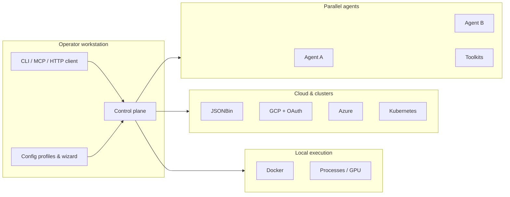

# Technical specification — AGCL

## Overview

AGCL is a **single-operator**, **Python-first** control plane that runs primarily on **one powerful workstation** and coordinates **local execution** with **cloud and cluster backends**. It exists so **AI researchers**, **agent engineers**, and **infra-minded builders** can drive **multi-agent workflows**, **parallel toolkits**, **containers**, **Kubernetes**, **GCP**, **Azure**, and lightweight hosted state (**JSONBin**) through **one configuration and routing surface**, instead of stitching ad hoc scripts per experiment. The system explicitly optimizes for **API spend discipline** by making **local compute** a first-class routing target while still allowing **cloud scale** where it matters.

This specification aligns with [`plan.md`](../plan.md) at the repository root and with contributor workflow in [`AGENTS.md`](../AGENTS.md). It is a **living document**: unresolved items stay in **Open Questions** until closed.

## Goals & Non-Goals

### Goals

- **Hybrid orchestration:** route work across **local processes**, **Docker**, **Kubernetes**, **GCP**, **Azure**, and **JSONBin** with a **unified policy layer** (profiles, budgets, safety rails) rather than per-integration shells.
- **Multi-agent “orchestra”:** run **multiple agents** and **multiple toolkits in parallel** under one supervisor—not a single sequential tool chain by default.
- **Research hooks:** support **recursive agent modelling**, **experimental background training**, and **persistent latent-state-style** improvement on **repeating tasks** without forcing a fixed persistence backend prematurely.
- **Interfaces:** ship **CLI**, **library/toolkit** surfaces, **HTTP** where appropriate (**FastAPI** / **Uvicorn** per [`pyproject.toml`](../pyproject.toml)), and **MCP** so **humans and coding agents** can operate the same capabilities.
- **Operator-tunable overhead:** treat **memory/latency budgets** as **configuration** (including a future **config wizard**) instead of hard-coded global SLAs.
- **Pragmatic secrets:** **environment / `.env` early** with a documented migration path to **cloud secret managers** once flows stabilize.

### Non-Goals

- **Multi-tenant SaaS:** **no** product posture that promises **hard isolation**, **per-tenant billing**, or **managed compliance** in early milestones.
- **Replacing cloud control planes:** AGCL **coordinates with** **Kubernetes**, **GCP**, and **Azure**; it does **not** reimplement their full APIs or schedulers.
- **Semi-transparent model provider product (near term):** shipping AGCL as a **full alternative “model provider”** that exposes **richer-than-text** surfaces is **explicitly deferred** per product intent—while remaining a credible **future evolution**.
- **Fixed global performance guarantees:** “Minimal overhead” is **operator-defined** through configuration; the repo does not claim universal numeric budgets.

## Design / Architecture Overview

### Components

- **Control plane (Python):** owns **routing**, **session/workflow state hooks**, **credential hand-off** (starting from `.env`, evolving to secret managers), and **policy** (credit-aware routing, parallelism limits, optional quotas).
- **Agent layer:** **multiple agents** and **toolkits** execute **concurrently**; the control plane schedules **parallel toolkit use** and prevents pathological contention via **profiles** (CPU/GPU/memory classes).
- **Local execution:** **processes**, **GPU** workloads, **Docker** workloads on the operator machine.
- **Cloud / cluster connectors:** **JSONBin** for lightweight hosted JSON; **GCP** with **OAuth**; **Azure**; **Kubernetes** contexts—introduced **incrementally** with explicit capability flags so partial environments remain usable.
- **Training & persistence services:** **experimental training** and **latent persistence** attach as **workers** or **background tasks** so they **do not block** the lightweight orchestration hot path.

### Interaction sketch

### Trade-offs

- **Python-first orchestration** trades raw startup micro-latency for **integration velocity** with ML and agent ecosystems—acceptable for a research control plane.
- **`.env` early** trades **enterprise secret posture** for **frictionless bootstrap**; migration must be **explicit** and **tested** before multi-account cloud workflows become default.
- **Connector breadth vs depth:** ship **narrow, reliable** integrations first (for example **Docker** and **one** cloud path) rather than **surface-complete** SDK coverage—consistent with staged rollout.

### Repository mapping (current)

The repo exposes **two related entry styles**: a **setuptools console script** (`uv run agcl`) backed by `src/agcl/`, and a **rich application entry** via `main.py` (FastAPI + subcommands). Until packaging is fully unified, treat **`main.py` + root `agcl/`** as the primary implementation surface for feature work and keep **`uv run agcl`** behavior aligned as the CLI evolves.

## Open Questions

- **JSONBin:** choose **initial use case** (session mirrors vs operator-visible sync vs scratch blobs), plus **retention** and **payload limits**.
- **GCP / Azure sequencing:** decide **first-milestone resources** (storage vs compute vs managed Kubernetes) and **minimum viable OAuth** flows for local operators.
- **OAuth token storage:** pick among **desktop redirect**, **device code**, or **cached tokens** with clear **rotation** semantics—must compose with the future **secret manager** migration.
- **Config wizard UX:** **TUI vs web vs CLI questionnaire**; **schema versioning** for profiles as connectors gain fields.
- **Latent persistence:** pick an initial representation (**embedding store**, **checkpoint references**, **JSONBin-backed summaries**) and consistency guarantees for **repeating tasks**.
- **Packaging convergence:** reconcile **`src/agcl/`** vs root **`agcl/`** so installs, imports, and docs describe **one** recommended developer workflow.

If none of the above block your change, still update this section when you close an item so downstream agents keep a single source of truth.
