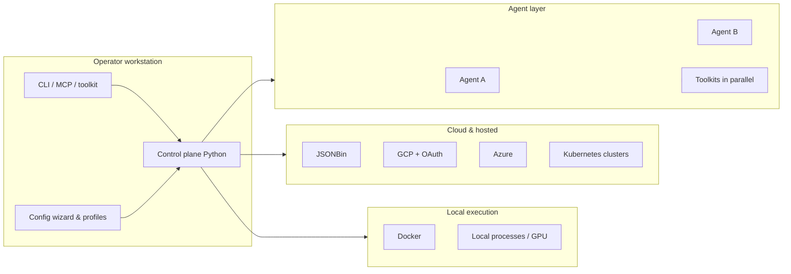

# AGCL — Hybrid local–cloud control plane for multi-agent research

**Tagline:** Run a lightweight orchestrator on your workstation that composes powerful local compute with cloud connectors, multi-agent toolkits, and training hooks—without standing up ad hoc glue for every experiment.

## Problem and primary user

AI researchers, agent engineers, and infra-oriented builders need a **single control plane** on a strong desktop that can route work across **local execution** and **cloud services**, coordinate **multiple agents** using **many toolkits at once**, and support **research workflows** (recursive agent modelling, experimental training, latent-state-style repetition) **without wasting API credits** on work that could run locally. The primary operator is a **single trusted user or small team** managing **one machine** as a first-class node—not a multi-tenant SaaS audience.

## Goals

- Provide a **Python-first** orchestration layer with **minimal baseline overhead**, tuned per operator via **configuration** (including a future **config wizard**).
- Enable **multi-agent orchestration** (“orchestra”) with **parallel toolkit** usage—not sequential single-tool flows by default.
- Integrate **hybrid execution**: local processes plus **Docker**, **GCP**, **Kubernetes-style** workflows, and named cloud paths (**JSONBin**, **GCP with OAuth**, **Azure**).
- Support **recursive agent modelling**, **background experimental training**, and **persistent latent-state-style** behavior for **repeating tasks**.
- Expose **CLI**, **programmatic toolkit**, and **MCP** so both humans and agents can drive the system.
- Keep **secrets** practical for early development (**environment / `.env`**) with a clear path to **cloud secret managers** later.

## Non-goals

- **Multi-tenant** product posture (isolated tenants, billing planes, per-customer data sovereignty) for early milestones.
- Shipping AGCL as a full **semi-transparent alternative “model provider”** that exposes richer-than-standard completion surfaces **in the first slice**—that product shape is **explicitly deferred** while remaining a plausible evolution.
- Replacing full cloud control planes (**Kubernetes**, **GCP**, **Azure**) wholesale—AGCL **coordinates** with them rather than reimplements them.

## Core functionality

From the operator’s perspective, AGCL is the **place you attach**:

- **Agents and tools:** multiple concurrent agents, multiple toolkits **simultaneously**, orchestrated under one policy and configuration surface.
- **Infra connectors:** bring **Docker**, **GCP**, **Kubernetes**, **JSONBin**, **GCP (OAuth)**, and **Azure** under one hybrid workflow so the workstation can act like a **mini control plane** or an extension of cloud accounts—without forcing a single deployment model.
- **Research and training hooks:** slots for **experimental training** and **latent-state-style** persistence so repeated tasks improve or stabilize without re-solving setup each time.
- **Interfaces:** **CLI** and library/toolkit entry points for scripting; **MCP** for agent-native integration.

## Architecture sketch

The **control plane** owns **scheduling, routing, credential hand-off** (starting from `.env`, evolving toward secret managers), and **policy** (credit-aware routing, resource profiles). **Training** and **latent persistence** attach as **services** or **workers** so they do not block the lightweight orchestration path.

## Technical stack

- **Language:** Python **≥ 3.13** (existing `pyproject.toml`).
- **API surface:** **FastAPI** and **Uvicorn** for HTTP services where needed.
- **ML / inference dependencies:** per `pyproject.toml` (e.g. **PyTorch**, **llama-cpp-python**, tokenization)—scoped so heavy stacks activate only when features need them.
- **Agents & HTTP:** **Anthropic**, **OpenAI**, **httpx** clients as integration points.
- **Infra:** **Docker** SDK/CLI patterns; **GCP** via OAuth-enabled flows; **Azure** SDKs as milestones dictate; **Kubernetes** via kubeconfig/context patterns; **JSONBin** for lightweight hosted JSON state where appropriate.
- **Interfaces:** **CLI** (console scripts via `uv run`), **MCP** server exposure as features land.
- **Secrets:** **environment variables / `.env` for early milestones**; **cloud secret manager integration** planned after core flows stabilize.

## Repo shape

- **`src/agcl/`** — single package containing CLI, control-plane core, connector adapters, and agent/toolkit integration layers.
- **`tests/`** — **pytest** layout mirroring package structure; prefer fast unit tests for orchestration logic.
- **`docs/`** — holds **`SPEC.md`** (Beam Phase 4) and supplemental architecture notes.
- **`collab_progress/`** — collaboration log (`PROTOCOL.md`, `CHANGELOG.md`, dated notes).
- **Root:** `pyproject.toml`, `README.md`, `plan.md`, optional `.env.example` once flows exist.

**Local dev:** install with **`uv sync`** (or equivalent), run **`uv run agcl`** for the CLI smoke path, **`uv run pytest`** for tests.

## Classification signals

- **Structured data store / transformation:** **Yes** — hybrid config, session routing, JSONBin and cloud resource metadata.
- **Programmatic surface (HTTP/RPC/CLI/MCP):** **Yes** — CLI, FastAPI where needed, MCP.
- **Non-trivial dependencies:** **Yes** — infra SDKs, ML stack optional but present in manifest.
- **Design trade-offs:** **Yes** — local vs cloud routing, credit conservation vs latency, training vs orchestration resource contention.
- **Security / privacy / observability:** **Yes** — credentials, OAuth, multi-cloud access; audit/logging expectations emerge with connectors.
- **Reliability / staged rollout:** **Yes** — connector maturity will be incremental (Docker vs full cloud parity).
- **Measurable success:** **Partially** — overhead and routing metrics should be **configurable per operator** rather than one global SLA.
- **Assumptions that may change:** **Yes** — secret backend, which Azure/GCP services are first-class, JSONBin usage patterns.
- **Heavy domain vocabulary:** **Moderate** — infra (K8s, GCP, Azure) plus ML/agent research terms.

## Constraints

- **Single-operator v1** on **one machine**; no multi-tenant isolation requirement initially.
- **Resource and “minimal overhead” targets are operator-defined** via **configuration / wizard**, not fixed repository-wide numbers.
- **Secrets:** start from **`.env` / environment**; plan migration to **cloud secret managers** without locking a vendor in `plan.md`.

## Alternatives considered

- **Polyglot control plane (Go/Rust) with Python for ML only:** rejected for **velocity and a single mental model**—**Python-first** was chosen for orchestrator and research integration.
- **Immediate vault-only secrets:** deferred in favor of **`.env` during bootstrap**, reducing friction for researchers.

## Open questions

- **JSONBin:** exact role (shared blobs vs session indexes vs operator-visible sync); retention and size limits.
- **GCP / Azure:** order of **service coverage** (storage vs compute vs AKS/GKE-first); which resource types are **must-have** for the first connector milestone.
- **OAuth:** flows and token storage for GCP/Azure (desktop redirect vs device code vs cached tokens)—ties to the future secret-manager story.
- **Config wizard:** UX (TUI vs web vs CLI questionnaire) and schema versioning for profiles.
- **Latent persistence format:** embedding store vs checkpoint references vs JSONBin-backed summaries—needs a concrete first design.

## Session notes

Discovery was **directive and stack-aware**: the user named **concrete cloud targets** and **multi-agent parallelism** early; tone favors **research velocity** and **pragmatic secrets** over enterprise tenancy.
